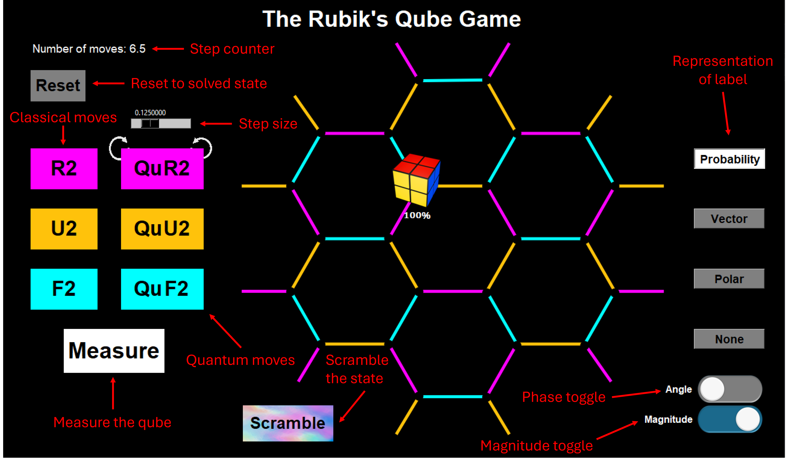

# The Qube Puzzle
Code for Karina Munro's 2025 Honours thesis at RMIT University.

## Installation (Conda required)

1. Create a new Conda virtual environment with Python 3.13.5. E.g.   
   `conda create -n qube python=3.13.5`    
   `conda activate qube`   

2. Clone or download the repository.

3. Change into the repository directory.   
   `cd "<path-to-repository-directory>"`

5. Install the dependencies.   
   `pip install -r requirements.txt`

6. Run the game.   
   `python the_qube_game_thesis.py`

## Instructions
To start the game, press the **Scramble** button. The aim of the game is to **Measure** the Qube and collapse the state to the solved state marked by the star ⭐. To increase your chances of solving the Qube, combine the amplitudes by using quantum **R2**, **U2**, and **F2** moves dictated by the **step size** (the sliding bar). Use the classical **R2**, **U2**, and **F2** moves to move the locations of basis states without changing the amplitudes.

Note: Click **Help**&#8594;**Keyboard Shortcuts** for shortcuts on all the functionalities.

## Examples of Code Output

### Windows
 

### Mac

